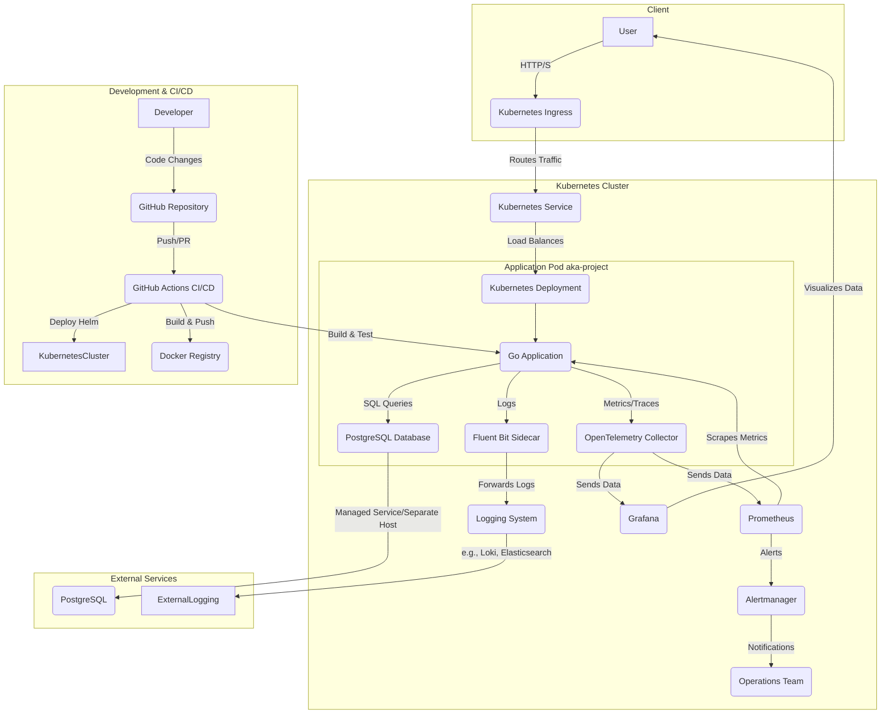

# aka-project

This project is a Go application that provides a character API.

## Table of Contents

- [Architecture Diagram](#architecture-diagram)
- [Setup](#setup)
  - [Prerequisites](#prerequisites)
  - [Environment Variables](#environment-variables)
  - [Database Setup](#database-setup)
  - [Install Dependencies](#install-dependencies)
- [Running Locally](#running-locally)
- [Testing](#testing)
- [Deployment](#deployment)
  - [Docker](#docker)
  - [Docker Compose](#docker-compose)
  - [Kubernetes with Helm](#kubernetes-with-helm)
- [GitHub Actions](#github-actions)
- [Production-Ready Alerts](#production-ready-alerts)


## Architecture Diagram



## Setup

### Prerequisites

Ensure you have the following installed:

*   **Go**: Version 1.22 or higher (as indicated by `go.mod`).
*   **Docker & Docker Compose**: For containerization and local orchestration.
*   **Helm**: For deploying to Kubernetes.
*   **kubectl**: Kubernetes command-line tool.
*   **sqlc**: For generating Go code from SQL (if you need to regenerate database code).

### Environment Variables

The application uses environment variables for configuration. A sample file `example.env` is provided.

1.  Copy `example.env` to `.env`:
    ```bash
    cp example.env .env
    ```
2.  Edit the `.env` file to configure your settings (e.g., database connection, API keys).

### Database Setup

This project uses `sqlc` for type-safe SQL.

1.  Ensure your database is running and accessible.
2.  Apply the schema:
    ```bash
    # Example for a PostgreSQL database
    psql -h localhost -U user -d database -f internal/db/schema.sql
    ```
3.  If you modify `internal/db/schema.sql` or `internal/db/query/characters.sql`, you will need to regenerate the Go code:
    ```bash
    sqlc generate
    ```

### Install Dependencies

Download the Go module dependencies:

```bash
go mod tidy
```

## Running Locally

To run the application directly on your machine:

```bash
go run cmd/api/main.go
```

The API should be accessible at the configured port (e.g., `http://localhost:8080`).

## Testing

Run all tests for the project:

```bash
go test ./...
```

To run specific tests or integration tests, navigate to the respective directories:

```bash
# Run tests in a specific package
go test ./internal/repository

# Run integration tests
go test ./tests/...
```

## Deployment

### Docker

The application can be containerized using Docker. The `Dockerfile` in the `deploy` directory is optimized for security and size.

To build the Docker image:

```bash
docker build -t aka-project:latest -f deploy/Dockerfile .
```

To run the Docker image:

```bash
docker run -p 8080:8080 aka-project:latest
```

### Docker Compose

Use Docker Compose to run the application and its dependencies (e.g., database) locally.

1.  Ensure your `.env` file is configured correctly for Docker Compose.
2.  From the project root, run:
    ```bash
    docker-compose -f deploy/docker-compose.yml up --build
    ```
    This will build the image (if not already built) and start the services.

### Kubernetes with Helm

The application can be deployed to a Kubernetes cluster using the Helm chart in the `deploy/helm` directory.

1.  **Install the Helm chart**:
    ```bash
    helm install aka-project deploy/helm
    ```
    You can also override the default values in `deploy/helm/values.yaml` using the `--set` flag or by providing a custom values file. For example, to set the replica count to 3:
    ```bash
    helm install aka-project deploy/helm --set replicaCount=3
    ```

2.  **Verify Deployment**:
    Check the status of your deployment:
    ```bash
    kubectl get pods -l app.kubernetes.io/name=aka-project
    kubectl get svc aka-project
    kubectl get ingress aka-project
    ```

## GitHub Actions

A GitHub Actions workflow is configured in `.github/workflows/ci.yaml`. This workflow will be triggered on every push to the `main` branch and on every pull request.

### Workflow Jobs

*   **`test`**: This job runs the Go unit and integration tests. It also runs linting and security scanning checks.
*   **`build_and_push_docker`**: This job builds the Docker image and pushes it to Docker Hub. This job will only run on pushes to the `main` branch.
    *   **Important:** You will need to change the Docker Hub username in the workflow file to your own username. You will also need to create a secret in your GitHub repository called `DOCKERHUB_TOKEN` with your Docker Hub access token.
*   **`deploy_and_test_helm`**: This job deploys the application to a KinD cluster and runs a simple test to check that the application is running correctly. This job will only run on pushes to the `main` branch.

### Code Quality Checks

The following code quality checks have been added to the `test` job:

*   **Linting:** The `golangci-lint` tool is now used to lint the Go code. This will help to ensure that the code is well-formatted and follows best practices.
*   **Security Scanning:** The `gosec` tool is now used to scan the code for security vulnerabilities. This will help to identify and fix potential security issues before they are deployed to production.

## Production-Ready Alerts

These alerts are designed to proactively notify about potential issues affecting the Characters API's availability, performance, and functionality. They are based on the metrics we've integrated.

**1. Alert Name: `HighCharactersApiErrorRate`**
*   **Description:** Triggers if the error rate for the `/characters` API endpoint exceeds a critical threshold.
*   **Prometheus Rule (Example):**
    ```yaml
    - alert: HighCharactersApiErrorRate
      expr: sum(rate(api_characters_errors_total[5m])) / sum(rate(api_characters_requests_total[5m])) > 0.05
      for: 5m
      labels:
        severity: critical
      annotations:
        summary: "High error rate on Characters API ({{ $value | humanizePercentage }})"
        description: "The Characters API is experiencing a high error rate (over 5%) for the last 5 minutes. This indicates a significant issue affecting users."
    ```
*   **Justification:** A high error rate directly impacts user experience and indicates a functional problem within the API. A 5% threshold over a 5-minute period is a common starting point for critical alerts, allowing for transient errors while catching sustained issues. This alert helps ensure the API's reliability.

**2. Alert Name: `CharactersApiHighLatency`**
*   **Description:** Triggers if the 99th percentile (P99) latency for the `/characters` API endpoint exceeds an acceptable performance threshold.
*   **Prometheus Rule (Example):**
    ```yaml
    - alert: CharactersApiHighLatency
      expr: histogram_quantile(0.99, sum(rate(api_characters_request_duration_seconds_bucket[5m])) by (le)) > 0.5
      for: 10m
      labels:
        severity: warning
      annotations:
        summary: "Characters API P99 latency is high ({{ $value }}s)"
        description: "The 99th percentile latency for the Characters API has been above 500ms for the last 10 minutes. Users might be experiencing slow responses."
    ```
*   **Justification:** High latency degrades user experience and can lead to user abandonment. Monitoring P99 latency (the experience of the slowest 1% of users) provides a good indicator of overall performance health. A 500ms threshold is a common target for API response times, and a 10-minute duration helps filter out brief spikes. This alert helps maintain API performance.

**3. Alert Name: `CharactersApiLowRequestVolume`**
*   **Description:** Triggers if the request volume for the `/characters` API endpoint drops significantly, potentially indicating an upstream issue or a problem with traffic routing.
*   **Prometheus Rule (Example):**
    ```yaml
    - alert: CharactersApiLowRequestVolume
      expr: sum(rate(api_characters_requests_total[5m])) < 10 AND sum(rate(api_characters_requests_total[15m])) offset 15m > 100
      for: 5m
      labels:
        severity: warning
      annotations:
        summary: "Low request volume on Characters API"
        description: "The Characters API is receiving significantly fewer requests than usual. This could indicate an upstream problem or a deployment issue."
    ```
*   **Justification:** A sudden drop in request volume, especially when compared to historical data, can be an early indicator of a critical problem that isn't necessarily an error (e.g., a client application failing to send requests, a load balancer misconfiguration). This alert helps detect silent failures where the API might appear "healthy" but isn't serving traffic.